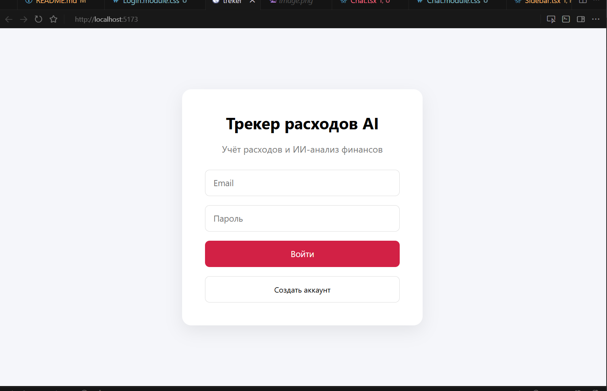
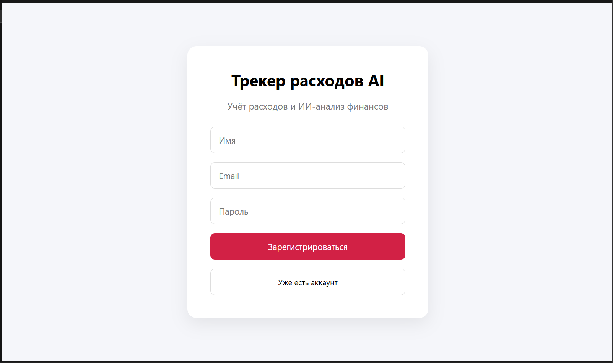
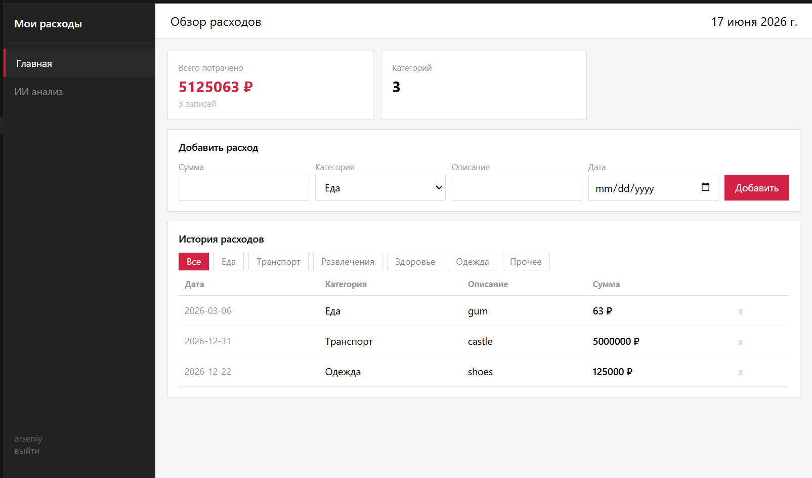
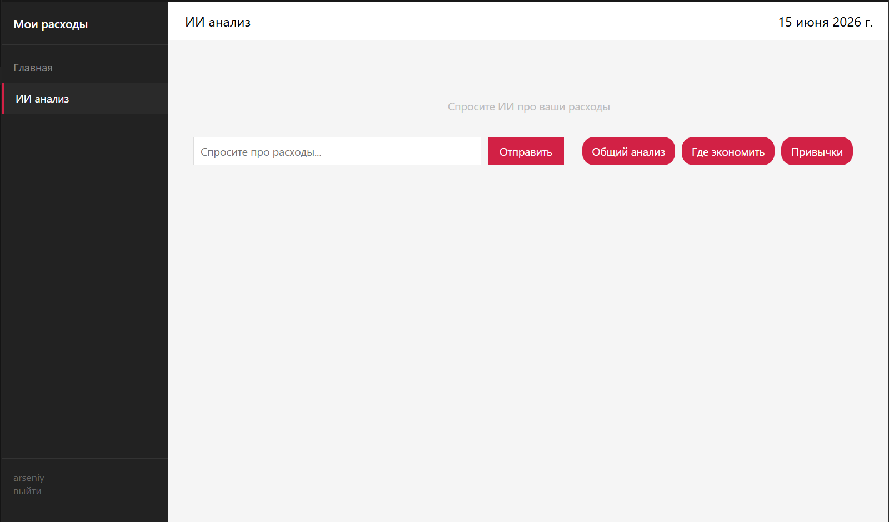
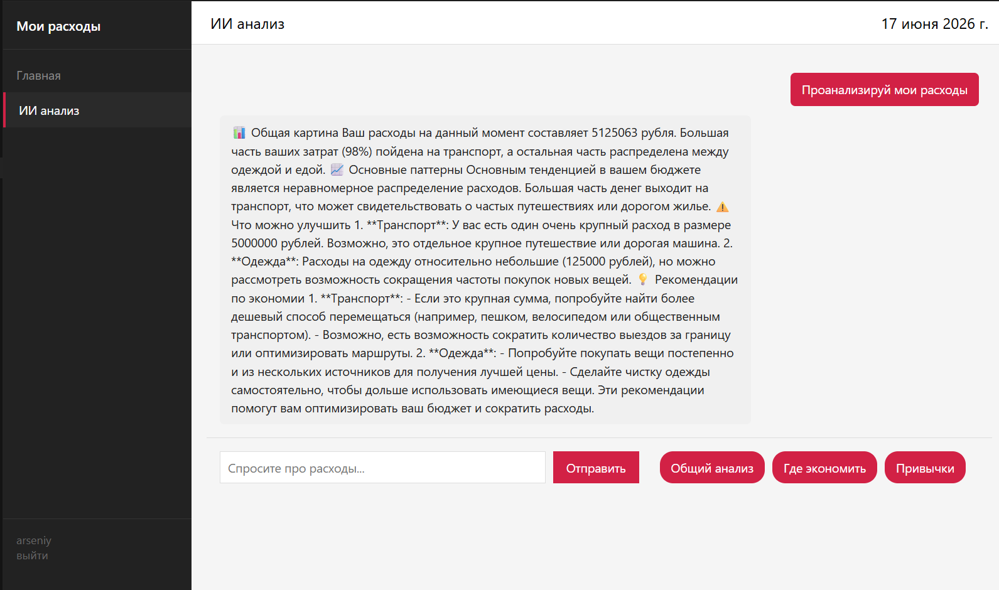
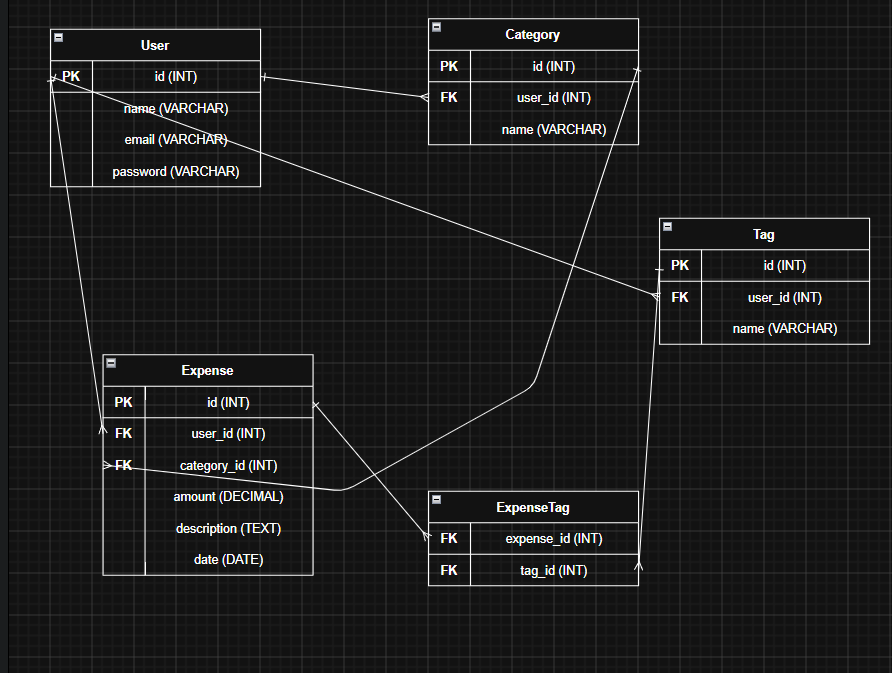
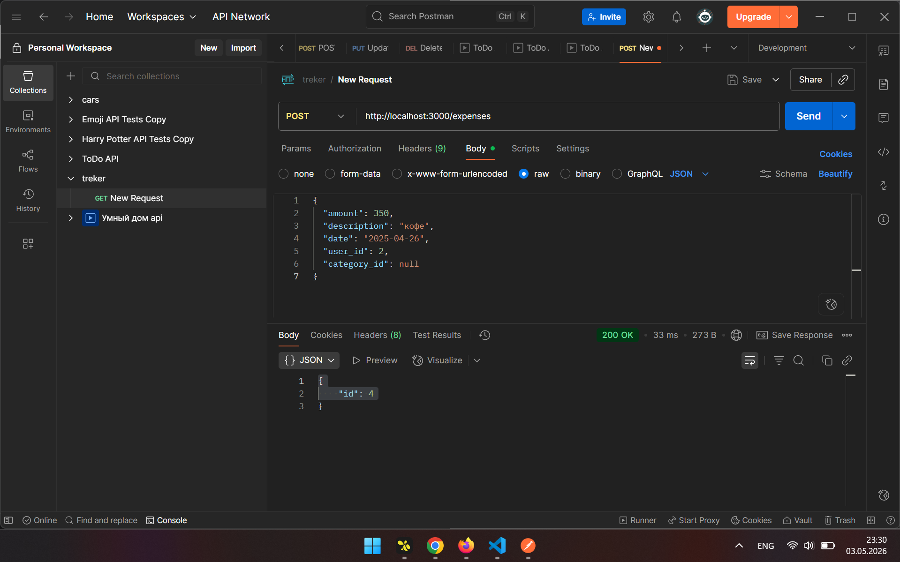
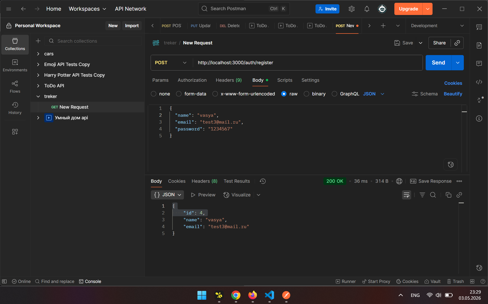
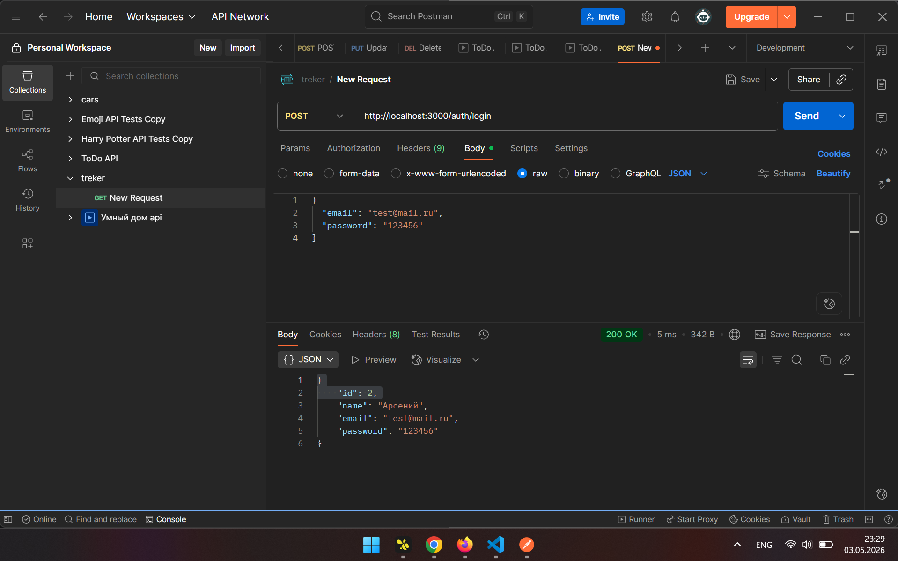
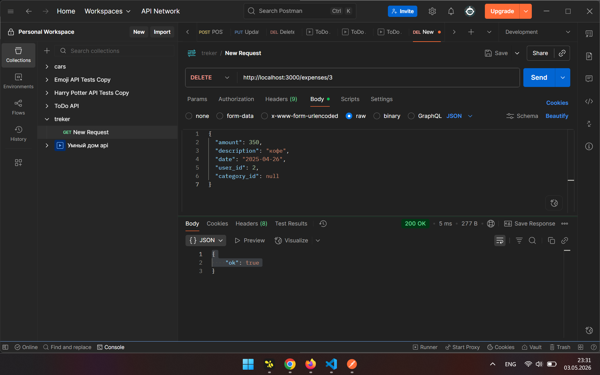

# Трекер расходов с ИИ-анализом

Fullstack expense tracker with JWT auth and local AI budget analysis via Ollama. React + Express + SQLite.

Веб-приложение для учёта личных расходов и получения рекомендаций по бюджету на основе ваших данных.

---

## Demo












---

## Возможности

- регистрация и авторизация пользователей
- JWT-аутентификация
- безопасное хранение паролей (bcrypt)
- добавление, редактирование и удаление расходов
- привязка расходов к пользователю
- фильтрация по категориям
- ИИ-анализ расходов через Ollama
- рекомендации по оптимизации бюджета

---

## Стек

**Frontend:** React, TypeScript, Zustand, Axios, Vite

**Backend:** Node.js, Express, SQLite, better-sqlite3, JWT, bcrypt

**AI:** Ollama, qwen2.5-coder

---

## Архитектура

```text
Frontend (React + Vite)
          |
          | HTTP
          |
Backend (Express)
          |
          |
SQLite Database

          |
          |
Ollama (AI)
```

---

## ER-диаграмма



---

## API

### Авторизация

| Метод | Эндпоинт       | Описание    |
| ----- | -------------- | ----------- |
| POST  | /auth/register | регистрация |
| POST  | /auth/login    | вход        |

### Расходы

| Метод  | Эндпоинт      | Описание                      |
| ------ | ------------- | ----------------------------- |
| GET    | /expenses     | получить расходы пользователя |
| POST   | /expenses     | добавить расход               |
| PUT    | /expenses/:id | обновить расход               |
| DELETE | /expenses/:id | удалить расход                |

### ИИ-анализ

| Метод | Эндпоинт      | Описание                     |
| ----- | ------------- | ---------------------------- |
| POST  | /chat/analyze | анализ расходов пользователя |

---

## Быстрый старт

### 1. Клонировать репозиторий

```bash
git clone <repository-url>
cd financetrackerAI
```

### 2. Настроить переменные окружения

```bash
cp .env.example .env
cp backend/.env.example backend/.env
```

Отредактируй `backend/.env` — задай свой `JWT_SECRET`.

### 3. Установить зависимости

```bash
npm install
cd backend && npm install && cd ..
```

### 4. Установить Ollama

https://ollama.com

```bash
ollama pull qwen2.5-coder:latest
```

### 5. Запуск

Backend:

```bash
cd backend
npm run dev
```

Frontend (в отдельном терминале):

```bash
npm run dev
```

| Сервис   | URL                      |
| -------- | ------------------------ |
| Frontend | http://localhost:5173    |
| Backend  | http://localhost:3000    |
| Ollama   | http://localhost:11434   |

--- 

## Postman











---

## интересно

- Multi-user архитектура: каждый пользователь видит только свои расходы через JWT middleware
- ИИ получает агрегаты по категориям из SQLite, а не выдумывает цифры
- Связка категорий через отдельную таблицу и JOIN между фронтом, API и чатом

