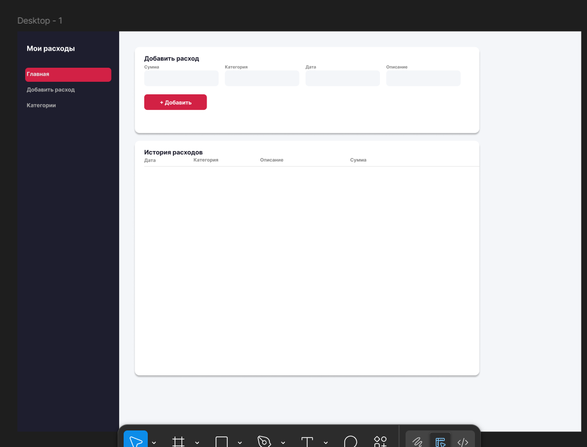
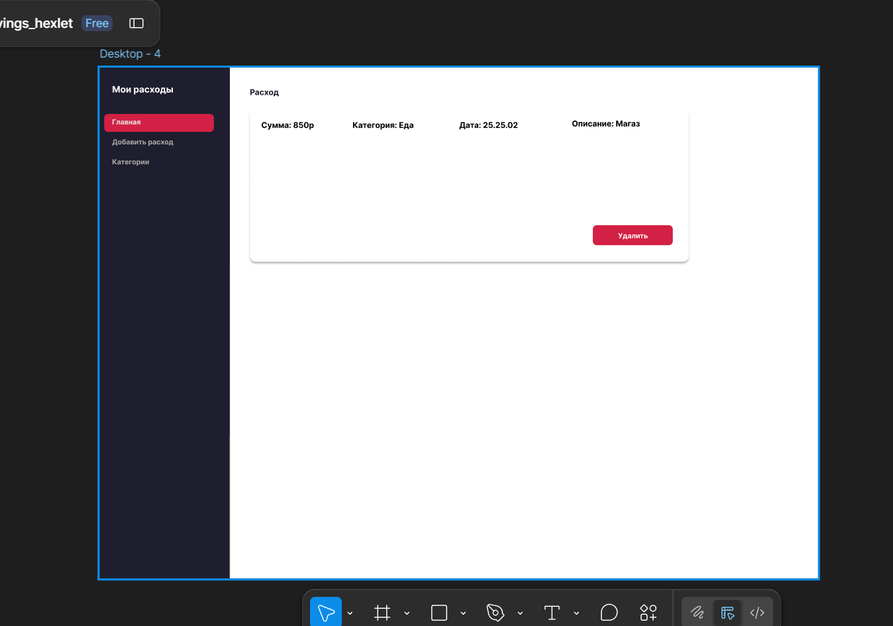
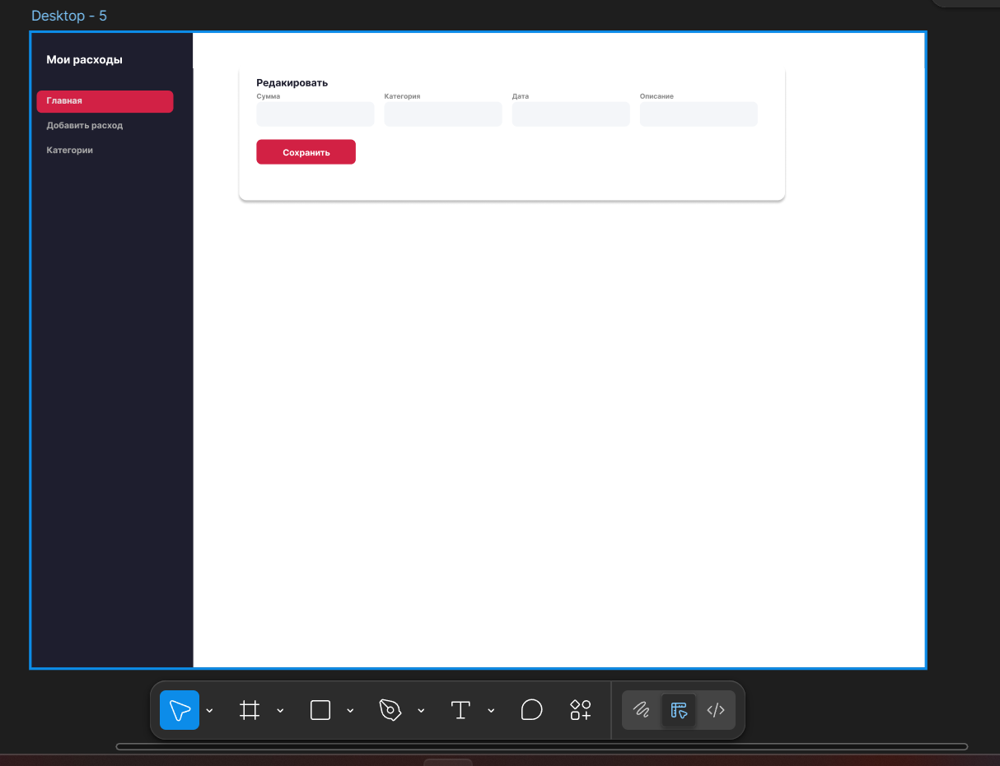
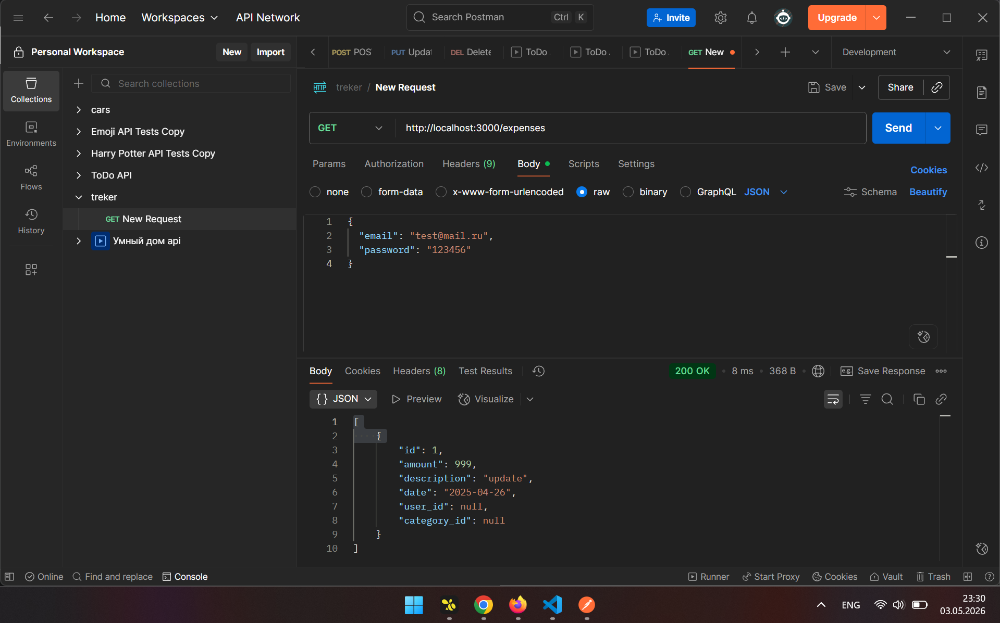
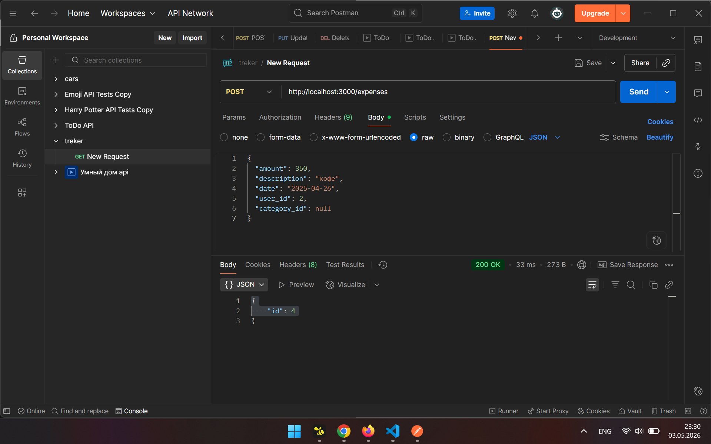
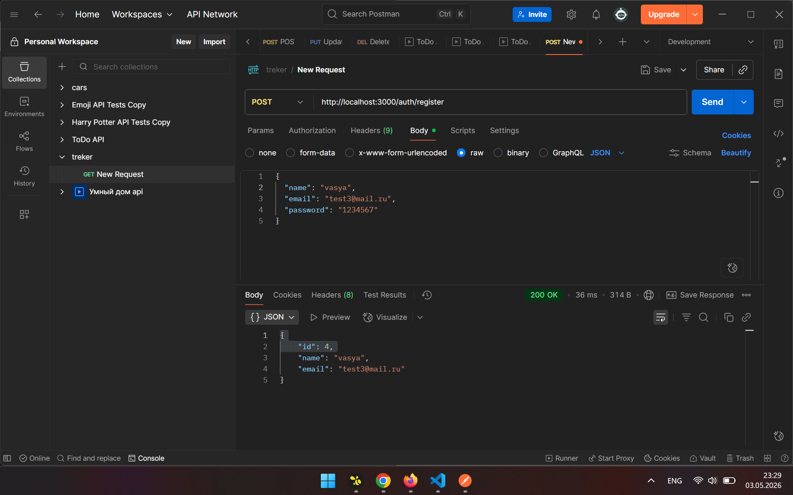
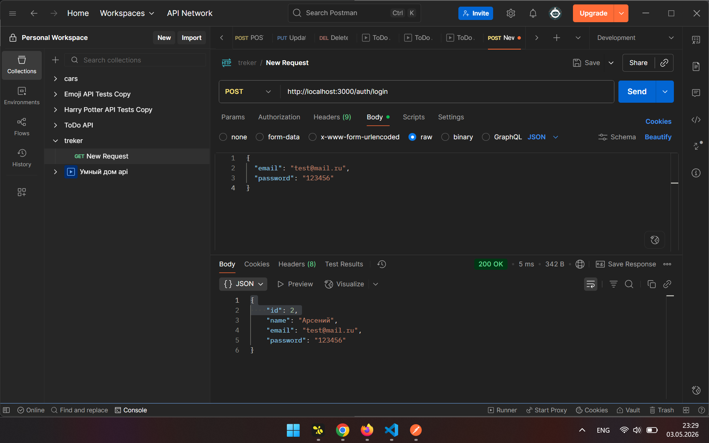
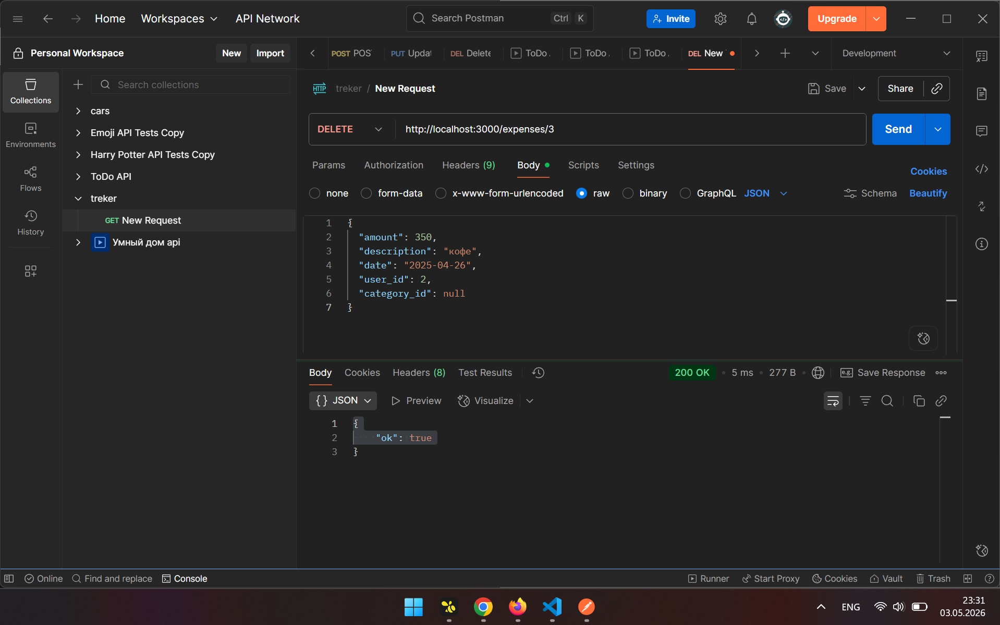

# Трекер расходов

Веб-приложение для учёта личных расходов. Можно добавлять траты, фильтровать по категориям и удалять записи.

## Техническое задание

## ER-диаграмма

## Макеты интерфейса

## Архитектура

Фронт на React общается с бэком через HTTP API. Бэк хранит данные в SQLite.
Frontend (React + Vite) -> HTTP -> Backend (Express) -> SQLite

## API

| Метод | Эндпоинт | Что делает |
|---|---|---|
| GET | /expenses | получить все расходы |
| POST | /expenses | добавить расход |
| DELETE | /expenses/:id | удалить расход |
| POST | /auth/register | регистрация | 
| POST | /auth/login | вход |

## postman

## Запуск

Бекенд
cd backend
npm install
npm run dev

Фронтенд
npm install
npm run dev

Фронт: http://localhost:5173  
Бэк: http://localhost:3000